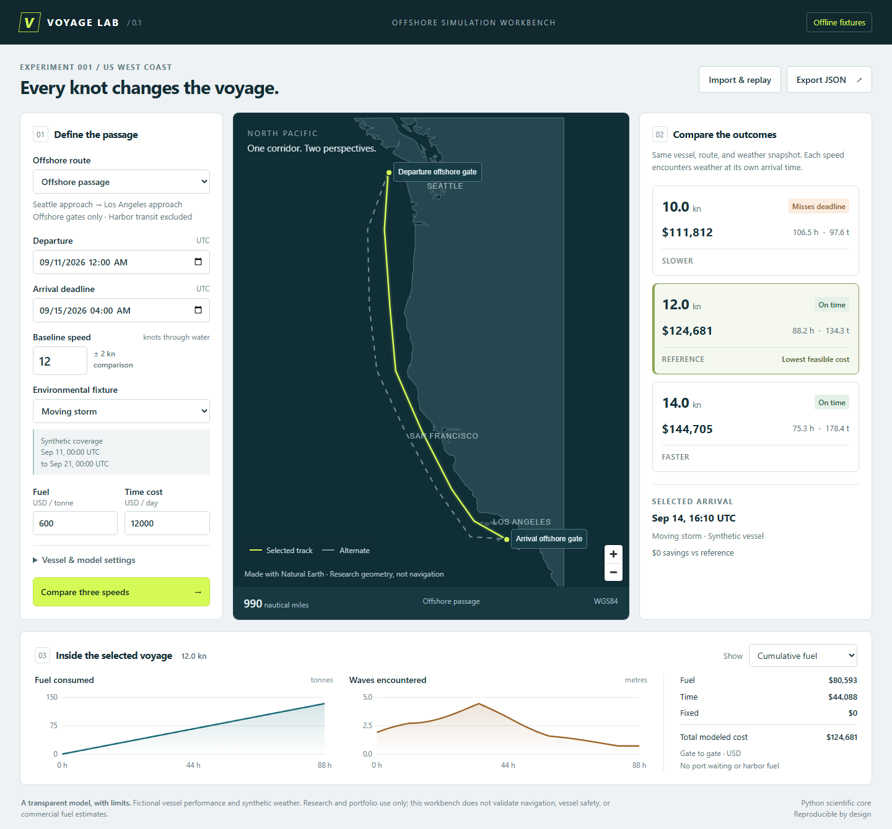

# Voyage Lab

A reproducible maritime voyage workbench: compare speed, arrival time, fuel, and cost while the vessel encounters changing weather along an offshore track.

**v0.1 is a working offline simulator.** It uses one fictional cargo vessel, two curated tracks between offshore gates near Seattle and Los Angeles, and five deterministic environmental fixtures. It does not validate navigation, vessel safety, or commercial fuel estimates.



## Run it

Prerequisites: CPython 3.12, Node.js 22 or 24, [uv](https://docs.astral.sh/uv/getting-started/installation/), and pnpm 11.19.0. Dependency installation needs internet access; the installed demonstration makes no external requests. No API keys, accounts, Docker, or database are needed.

From the repository root, in PowerShell, bash, or zsh:

```sh
uv sync --frozen
pnpm --dir web install --frozen-lockfile
pnpm --dir web build
uv run --frozen python -m uvicorn voyage_lab.api:app --host 127.0.0.1 --port 8000
```

Open [http://127.0.0.1:8000](http://127.0.0.1:8000). Keep that terminal running. Press Ctrl+C to stop. The API serves the compiled React application on the same origin. Rebuild and restart after changing production assets.

The saved example departs **11 September 2026 at 00:00 UTC**, with a deadline 100 hours later. The fixed fixture dates are intentional; this is a reproducible experiment, not current weather. Coverage ends 21 September 2026 at 00:00 UTC. Setting a departure outside coverage returns a visible failure rather than invented calm conditions.

For frontend development, keep the API running and use `pnpm --dir web dev` in a second terminal; Vite prints its local URL and proxies `/api` to port 8000.

### CLI without the web application

```sh
uv run --frozen voyage-lab demo --output artifacts/comparison.json
uv run --frozen voyage-lab replay artifacts/comparison.json
uv run --frozen voyage-lab demo --fixture calm --speeds 10 12 14
```

`demo` compares three increasing speeds. `simulate scenario.json` accepts a single SI scenario document. `replay` recomputes each exported trajectory from embedded inputs, verifies content hashes, and compares every result value. A JSON export can travel to another installation; it does not depend on a local database or cached weather.

## What to try

1. Open the default moving-storm example. The 10-knot run misses the deadline; 12 and 14 knots arrive on time.
2. Select each scenario to inspect its ETA, fuel, waves, and cost breakdown.
3. Move the deadline later and compare again. The lower-fuel scenario may become feasible.
4. Switch to calm water, head seas, or a current fixture to see the assumptions change the outcome.
5. Open vessel settings and change reference consumption or halve the integration step.
6. Export JSON, reload the page, then import it. The confirmation appears only after numerical replay succeeds.

The highlighted best result is the least expensive **feasible scenario in the current comparison**, not a globally optimal route or speed. USD costs are user assumptions. Negative savings versus the reference are displayed honestly.

## Verify it

```sh
uv run --frozen pytest -q
uv run --frozen ruff check voyage_lab scripts tests benchmarks
uv run --frozen ruff format --check voyage_lab scripts tests benchmarks
pnpm --dir web build
pnpm --dir web exec playwright install chromium
pnpm --dir web test:e2e
uv run --frozen python -m benchmarks.run
```

The browser suite starts the API when necessary. It tests comparison, alternate tracks, selection, JSON export/replay, invalid inputs, missing coverage, bad imports, and mobile overflow. External HTTP requests are blocked during the main workflow. On Linux, Playwright may require `playwright install --with-deps chromium` to install browser system libraries.

The scientific suite checks the 240-nautical-mile hand calculation ($25,200), current projections, track holding, weather timing and directions, geometry, coverage, step convergence, and export integrity. See [verification evidence](docs/STATUS.md) and the [measured case study](docs/CASE_STUDY.md). Both local Windows verification and [Ubuntu CI](https://github.com/AlexanderDaly/voyage-lab/actions) pass.

## Architecture

```text
React + TypeScript + MapLibre (web/)
                    |
               FastAPI (voyage_lab/api.py)
                    |
      validated inputs + pure simulation (models.py, core.py)
                    |
   NumPy interpolation + pyproj geodesics + Shapely geometry

CLI ----------------+      JSON fixtures bundled in voyage_lab/data/
```

The core performs no filesystem or network access. The catalog loads local fixtures; the export layer records input hashes, model version, source revision when available, and a fingerprint of the scientific implementation. The package contains its fixtures and works as an installed wheel.

There is no persistence service. The browser holds the current comparison in memory; export before closing it. The local API does not save uploaded scenarios. API documentation is available at `/docs`; endpoints are under `/api`. [Model contract](docs/MODEL.md) · [architecture decisions](docs/DECISIONS.md) · [roadmap](docs/ROADMAP.md) · [upstream assessment](docs/UPSTREAM.md).

## Attribution and license

Original code and synthetic fixtures: MIT. Regional land data: Natural Earth 5.1.2, public domain, clipped to the demo bounds. See [third-party notices](THIRD_PARTY_NOTICES.md) and the bundled provenance record. This is an independent portfolio project with original branding and implementation.
